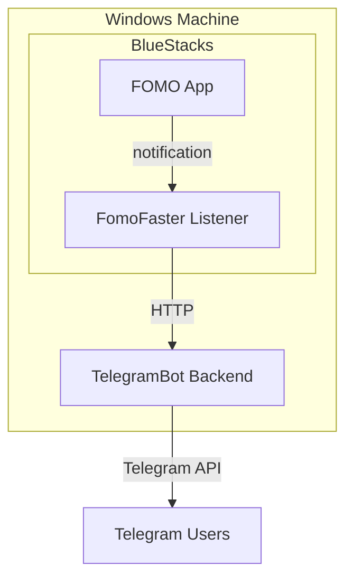

# FomoFaster

Real-time FOMO app trade notifications to Telegram.

## Architecture



## Components

| Folder | Purpose |
|--------|---------|
| `android-listener/` | Android app that intercepts FOMO notifications and forwards raw text to backend. Acts as a dumb proxy - no parsing logic, just captures and sends. |
| `telegram-bot/TelegramBot/` | C# backend that receives notifications, parses trader/token/amount, stores in SQLite DB, and sends formatted messages to Telegram. |

## Prerequisites

- **.NET 8.0 SDK**
- **BlueStacks 5**

Only if rebuilding the Android app (unlikely - it's a dumb proxy, just forwards notifications):
- Android Studio (includes SDK, Gradle, ADB)

## Setup

### 1. Create Telegram Bot
1. Message [@BotFather](https://t.me/BotFather) → `/newbot` → follow prompts → copy token

Users interact with the bot directly via DMs. The bot sends trade notifications to users who subscribe.

### 2. Backend Configuration

```cmd
cd telegram-bot\TelegramBot
dotnet user-secrets set "Telegram:BotToken" "YOUR_BOT_TOKEN"
```

### 3. Run Backend

```cmd
cd telegram-bot\TelegramBot
dotnet run
```

Should show:
```
Now listening on: http://0.0.0.0:8000
```

### 4. Install Android App

Drag `android-listener\app\build\outputs\apk\debug\app-debug.apk` into the BlueStacks window, or double-click the APK to install.

### 5. Configure Android App

In BlueStacks:
1. Open "FomoFaster Listener"
2. Set backend URL: `http://10.0.2.2:8000`
3. Tap "Save Configuration"
4. Tap "Enable Notification Listener" → enable permission in Android Settings
5. Tap "Test Connection" → should succeed

> `10.0.2.2` is the special alias Android emulators use to reach the host machine's localhost. `127.0.0.1` from inside BlueStacks points to BlueStacks itself.

### 6. FOMO App

Install FOMO app in BlueStacks, log in, and follow traders.

Traders are auto-added to the database when notifications come in. You can also bulk-add via API:

```cmd
curl -X POST http://localhost:8000/api/traders/bulk-add ^
  -H "Content-Type: application/json" ^
  -d "{\"handles\": [\"ansem\", \"frankdegods\", \"blknoiz06\"]}"
```

## Viewing Logs

**Backend:**
Watch the terminal running `dotnet run`

**Android app (requires ADB):**
```cmd
adb connect 127.0.0.1:5555
adb logcat | findstr FomoListener
```

## Rebuilding Android App (if needed)

Only necessary if you modify the Android source, which is not really meant to happen:

```cmd
cd android-listener
gradlew.bat assembleDebug
adb install -r app\build\outputs\apk\debug\app-debug.apk
```

## Project Structure

```
fomofaster/
├── android-listener/           # Android notification listener
│   └── app/src/main/java/...   # Java source
├── telegram-bot/
│   └── TelegramBot/            # C# backend
│       ├── Controllers/        # API endpoints
│       ├── Services/           # Business logic
│       ├── Models/             # Data models
│       ├── Data/               # SQLite DB context
│       └── Migrations/         # EF Core migrations
├── connect-bluestacks.bat      # Helper to connect ADB
└── README.md                   # This file
```

## Troubleshooting

**"Listener not enabled"**
→ Enable notification permission in Android Settings

**"Connection failed" from Android app**
→ Backend not running, or Windows Firewall blocking port 8000

**No notifications appearing**
→ Check FOMO app is logged in and you're following traders
→ Check logs: `adb logcat | findstr FomoListener`

**Telegram not receiving messages**
→ Verify bot token is correct
→ Make sure user has started the bot (sent `/start`)
